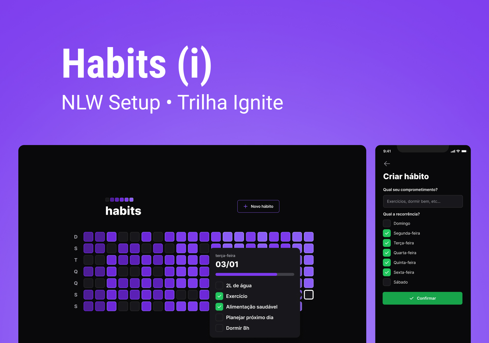

<p align="center">
  
</p>

<div align="center">
  
  
  

  
</div>

<h1 align="center">
  NLW Setup
</h1>

<br>

## 🧪 Technologies

This project was developed using the following technologies:

- [ReactJS](https://reactjs.org/)
- [CVA](https://github.com/joe-bell/cva)
- [NextJS](https://nextjs.org/)
- [NodeJS](https://nodejs.org/en/)
- [Fastify](https://www.fastify.io/)
- [Prisma](https://www.prisma.io/)
- [Postgres](https://www.postgresql.org/)
- [Zod](https://github.com/colinhacks/zod)
- [React Hook Form](https://react-hook-form.com/)
- [Vitetest](https://vitest.dev/)
- [Docker](https://www.docker.com/)
- [Eslint](https://eslint.org/)
- [Prettier](https://prettier.io/)
- [RadixUI](https://www.radix-ui.com/)
- [NextAuth](https://next-auth.js.org/)

## 🚀 Getting started

Clone the project and access the folder.

```bash
git clone https://github.com/nitoba/nlw-setup

cd nlw-setup
```

Run this command to install the dependencies for web go to web and server folders.

```bash
npm install
```

Ensure that you have docker installed to run database PostgreSQL using docker compose
Run docker compose up to up database

Run this command to run server

```bash
npm run dev
```

Run this command to run web application

```bash
npm run dev
```

## New Features implemented

## Backend

    - [X] - JWT AUTHENTICATION
    - [X] - Es
    - [X] - Unit tests using Vitest
    - [X] - Backend structure looks like Clean Architecture or DDD (Following design patterns)

## Frontend

    - [X] - NextJS
    - [X] - Google Authentication using NEXTAUTH
    - [X] - Google Authentication using NEXTAUTH
    - [X] - Components using variant with class-variance-authority (cva)
    - [X] - Form validations using React Hook Form e Zod
    - [X] - Datafetch and caching with React Query
    - [X] - Custom Message Toast to show feedback about habit creation

## 🔖 Layout

You can view the layout through the link below:

- [Figma Layout](<https://www.figma.com/file/EXrVCr6rlVX1ZiiWNuqDJt/Habits-(i)-(Community)?t=uVx6sQLGc6rVZRae-6>)

## 📝 License

This project is licensed under the MIT License. See the [LICENSE](LICENSE) file for details.

---

Made with 💜 by [Bruno Alves](https://nito-dev.vercel.app/) 👋
